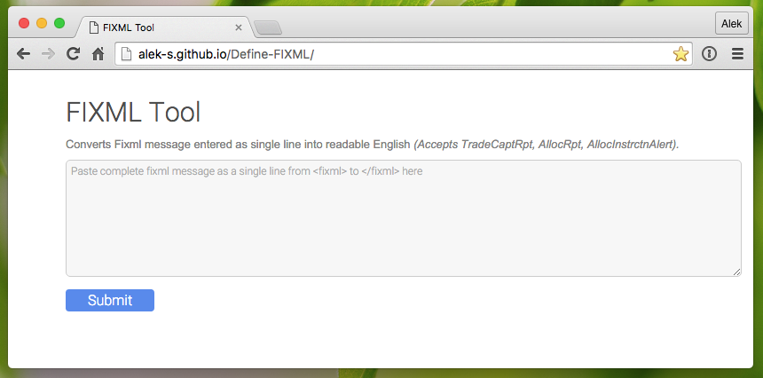
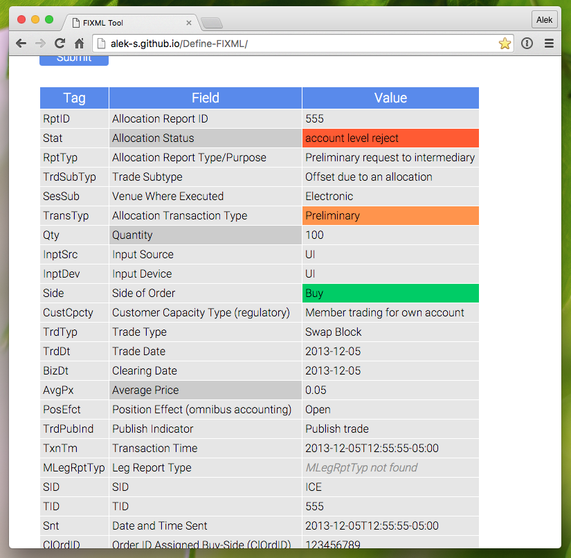

# Define-FIXML
Deliminates and defines Fixml message into readable English. Currently accepts TradeCaptRpt, AllocRpt, AllocInstrctnAlert.

#### Try It Now: [Page Link](http://alek-s.github.io/Define-FIXML/)

### Use
1. Enter a FIXML message from open tag to closing tag. Message should be one line as it would be sent by a clearing house.

2. Press submit, and enjoy your easy to read table spelled out in plain English. You can also copy and paste this table into Word, Excel or an email.

